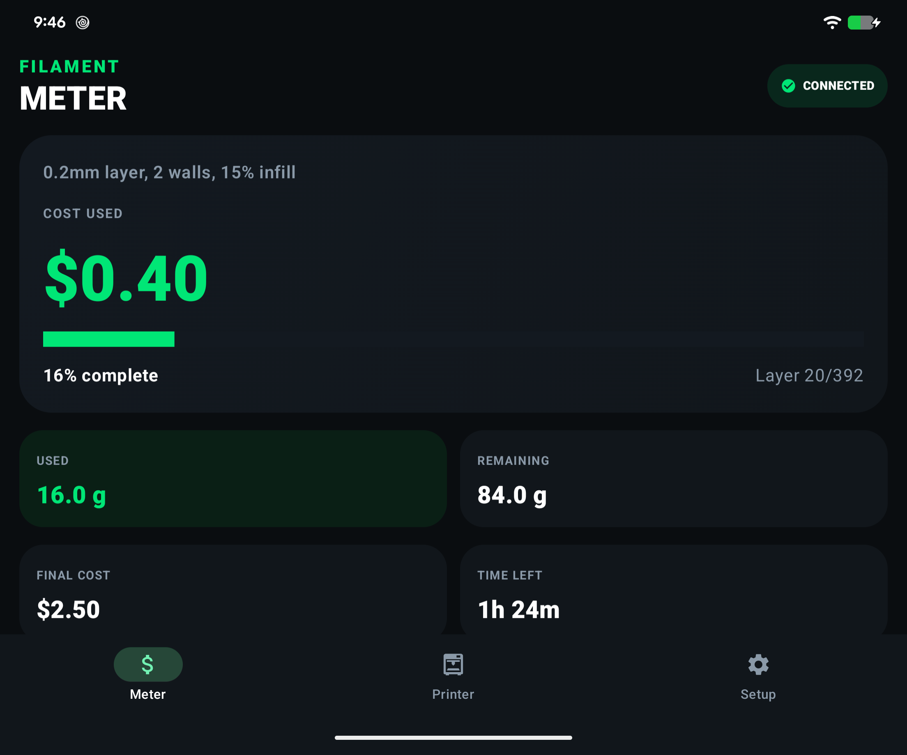
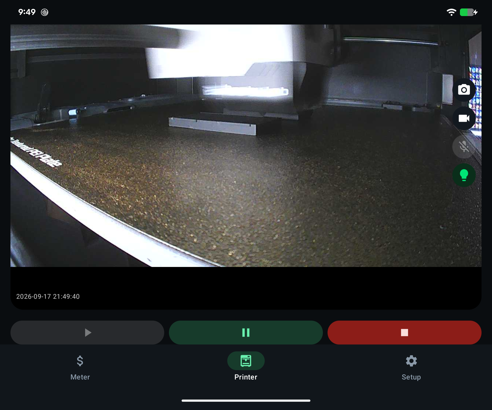
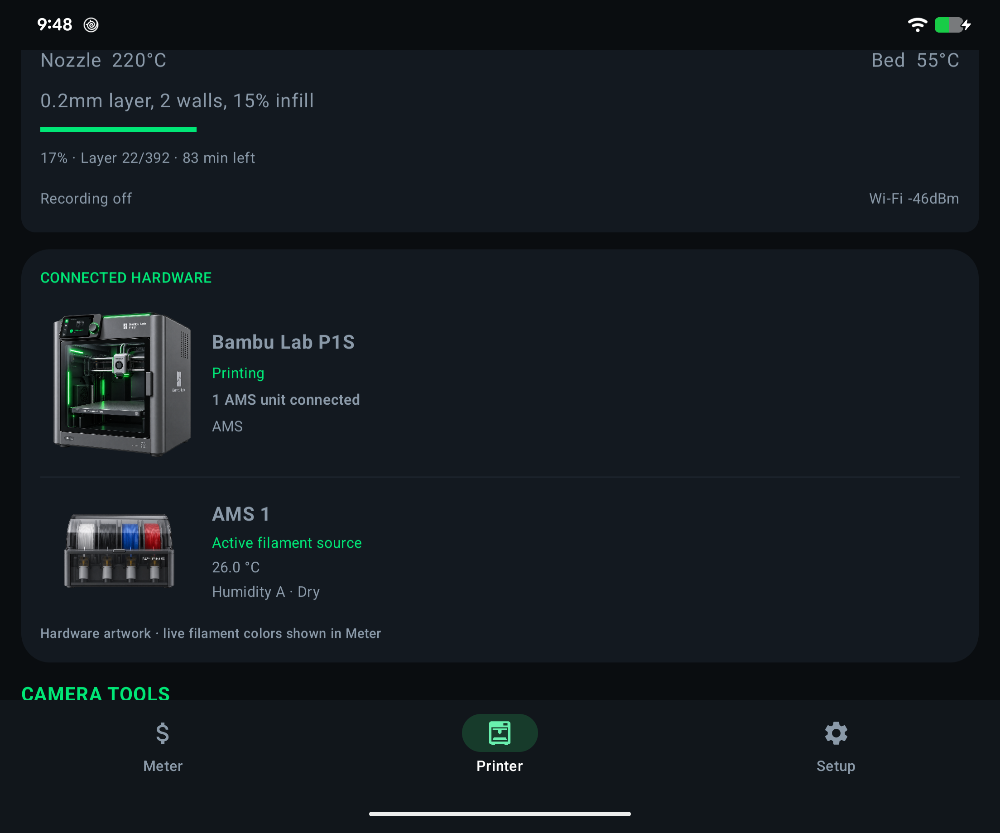
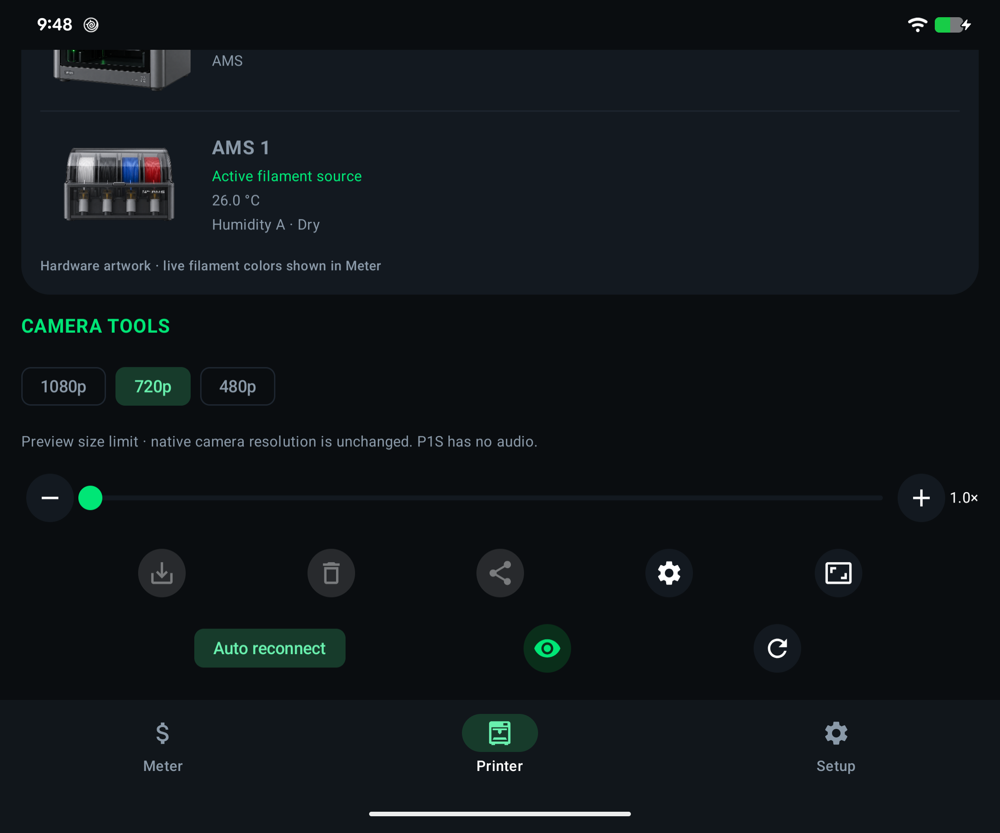
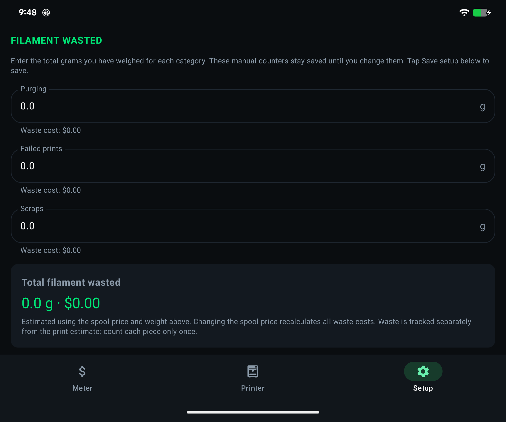

# Filament Meter

**0.1.0-beta.2** — an early beta Android companion for Bambu Lab printers.

Monitor a printer over your local network, estimate filament cost, view the P1-series camera, and follow progress from a home-screen widget or quiet notification.

## Features

- Live job progress, layers, remaining time, temperatures, and estimated filament cost.
- Printer camera with fullscreen, zoom, snapshots, save/share, and reconnect.
- Resume, pause, stop (with confirmation), chamber light, and supported printer SD-card recording controls.
- Automatic printer artwork and multiple AMS unit detection, live filament bays, and humidity reporting.
- Background MQTT monitoring with automatic reconnect and a silent ongoing progress bar. Separate event notifications report start, pause/resume, completion, and new issues.
- Bambu error descriptions, reported error codes, and official troubleshooting links.
- Responsive home-screen widget with controls when expanded.
- Built-in instructions for finding the printer LAN access code.
- Separate saved printer profiles, network discovery, a fleet overview, and active-printer selection.
- Per-printer estimated print history and dated purging, failed-print, and scrap waste records.
- Current print model thumbnails retrieved from the printer, with tap-to-enlarge.
- Experimental on-device YOLO detection with labeled camera overlays, captured warning evidence, and distinct sound/vibration alerts for spaghetti, lifting, and layer shifts. See [Print watch](docs/PRINT_WATCH.md) for model setup and limitations.

## Screenshots

Actual Pixel Fold captures during a live P1S print. Printer IP addresses, serial numbers, and LAN access codes are not shown. Click an image to view it at full size.

| Live cost and progress | Chamber camera and print controls |
| --- | --- |
|  |  |

| Printer and AMS status | Camera tools |
| --- | --- |
|  |  |

**Waste counters:**



## Install and connect

Download the APK from [GitHub Releases](https://github.com/nahalewski/filamentmeter/releases). Android 8.0 or newer is required.

1. Install the APK and allow notifications when prompted.
2. Connect the phone to the printer's local network.
3. Open **Setup** and enter the printer IP, serial number, and LAN access code. The instructions at the bottom explain where to find the code.
4. Enter spool price, spool weight, and the slicer's estimated filament usage; save.
5. Connect to start background monitoring. Disconnect stops monitoring.

The signed release APK cannot update an older development APK signed with the Android debug key. Uninstall the development build before installing this release, then enter the printer settings again. Future releases using the same release key can update this beta normally.

## Beta limitations

Experimental **YOLO print watch** processes the printer camera on-device and warns about possible failures; it does not automatically pause the printer. See [setup, model licensing, and detection limitations](docs/PRINT_WATCH.md) and the release notes for model availability.

- Tested with a P1S on Pixel Fold and Pixel 9 Pro Fold. Other printer identities/artwork and AMS configurations are supported by telemetry parsing but are not all hardware-tested.
- Camera streaming currently implements the P1-series LAN JPEG protocol on port 6000. Other printer families may require a different camera protocol. Preview size controls do not increase the native camera frame rate or resolution.
- Play resumes a paused job. Start new print files from your slicer.
- Cost is an estimate: `sliced filament grams × progress fraction × price per gram`.
- Camera preview stops in the background unless experimental YOLO print watch needs frames for a running print. Telemetry monitoring continues through a foreground service. Force-stop, restricted battery settings, or loss of LAN access can interrupt monitoring. Background monitoring uses additional battery.
- LAN controls depend on printer firmware and permissions. MQTT uses TLS port 8883 with the printer's local self-signed certificate; use a trusted local network.
- Error descriptions come from Bambu Studio's cached English HMS catalog. Unknown codes link to the official troubleshooting hub.

## Build

Use JDK 17 or Android Studio's compatible bundled JDK and Android SDK 35. Configure your SDK path through Android Studio or a local `local.properties` file.

```sh
./gradlew :app:assembleDebug :app:testDebugUnitTest :app:lintDebug
```

For a signed release, set these environment variables to your private signing credentials:

- `FILAMENTMETER_KEYSTORE`: absolute path to the keystore
- `FILAMENTMETER_STORE_PASSWORD`: keystore password
- `FILAMENTMETER_KEY_PASSWORD`: password for alias `filamentmeter`

```sh
./gradlew :app:assembleRelease :app:testReleaseUnitTest :app:lintRelease
```

On Windows, use `gradlew.bat`. Without signing environment variables, the release variant produces an unsigned APK. Keep signing keys and passwords backed up outside this repository; they are required to distribute compatible updates.

## License

Copyright (C) 2026 Filament Meter contributors. Licensed under [AGPL-3.0](LICENSE), without warranty. Version 0.1.0-beta.2 includes the pinned YOLO model. See [third-party licenses and model provenance](THIRD_PARTY_NOTICES.md); dependencies retain their own terms. License texts and a source link are also available in Setup > Licenses and source.

## References and assets

See [multiple printers and cost records](docs/MULTI_PRINTER.md), [current model previews](docs/PRINT_PREVIEW.md), and [alert sounds](docs/ALERT_SOUNDS.md) for setup and limitations.

This is an independent project, not an official Bambu Lab application. Printer and AMS artwork was supplied for this project; Bambu Lab names and marks belong to their respective owners. See `app/src/main/assets/printer_errors_source.txt` for error catalog provenance.

- [Bambu Lab HMS troubleshooting](https://wiki.bambulab.com/en/hms/home)
- [OpenBambuAPI MQTT documentation](https://github.com/Doridian/OpenBambuAPI/blob/main/mqtt.md)
- [ha-bambulab telemetry reference](https://github.com/greghesp/ha-bambulab)
